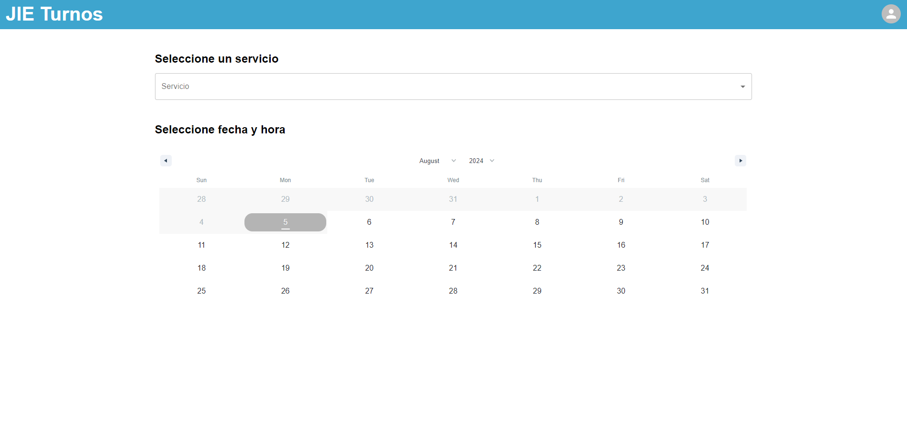
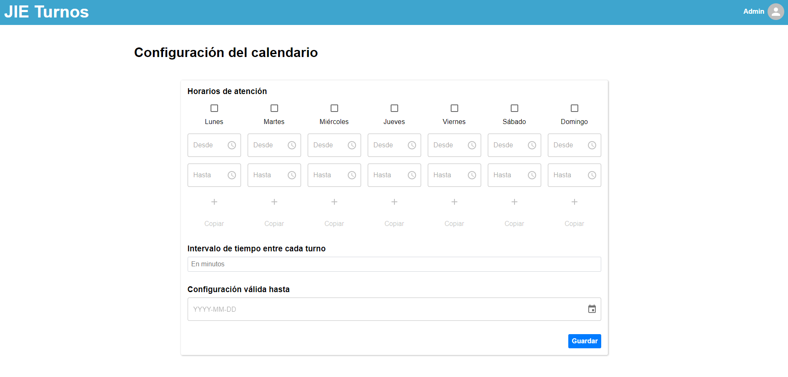

# Sistema de Gestión de Turnos

Una aplicación web fullstack para facilitar la gestión de turnos en diversas industrias, como barberias, salones de belleza, y otros servicios que requieren de una cita previa. El proyecto esta desarrollado con Node.js y Express en el backend y React con Material-UI para el frontend.
La aplicación cuenta con dos tipos de usuarios con diferentes niveles de acceso:

- **Cliente**: Usuarios que reservan turnos y gestionan su información personal.
- **Administrador**: Usuarios con permisos elevados que gestionan la aplicación y los turnos disponibles.

## Objetivo
El objetivo principal del proyecto es dar una solución simple para la administración de turnos, perimitiendo a los usuarios finales solicitar turnos y a los administradores gestionar la disponibilidad de turnos y servicios de manera sencilla y organizada.
## Demo

Puedes probar la aplicación en vivo aquí: [Sistema de Gestión de Turnos - Demo](https://jieturns.vercel.app/)

### Cuentas de prueba
Para explorar la aplicación desde diferentes perspectivas, usa laas siguientes credenciales de prueba:

#### Cliente
- **Email**: cliente@example.com
- **Contraseña**: cliente123

#### Administrador
- **Email**: admin@example.com
- **Contraseña**: admin123
## Screenshots

- **Pantalla de inicio**: 

- **Programación de calendario**: 


## Features

### Funcionalidades Principales

- **Registro y Autenticación de Usuarios**: Permite a los usuarios registrarse y autenticarse de manera segura utilizando JWT.
- **Programación de Turnos**: Clientes y administradores pueden visualizar la disponibilidad y reservar turnos de manera intuitiva.
- **Modificar Información de Perfil**: Tanto clientes como administadores tienen la posibilidad de modificar su información (Contraseña, Nombre de usuario, Teléfono).
- **Visualizar reservas**: Los usuarios pueden ver sus reservas y cancelarlas si es posible.

### Funcionalidades de Administración:
- **Gestión de usuarios**: Los administradores pueden visualizar todos los usuarios de la aplicación y tienen la posibilidad de asignarle otro rol.
- **Configuración de servicios**: Los administradores pueden visualizar, agregar, editar y eliminar los servicios disponibles de la aplicación.
- **Configuración de Calendario**: Los administradores pueden ajustar los horarios de disponibilidad para los turnos, establecer la duración de cada uno, y definir hasta qué fecha es válida esta configuración.
- **Visualizar Reservas de Clientes**: Los administradores pueden visualizar las reservas de todos los usuarios por fecha para organizarse.

### Otros
- **Interfaz Responsive**: Diseño adaptable para garantizar una buena experiencia en dispositivos móviles y de escritorio.
- **Adaptado a la Zona Horaria de Argentina**: Los horarios de disponibilidad y la programación de turnos están configurados para ajustarse a la zona horaria de Argentina (ART). Esto asegura que la aplicación funcione correctamente según la hora local en Argentina.

### Funcionalidades Futuras
Estas son algunas de las funcionalidades que planeo agregar en futuras versiones del proyecto:

- **Notificaciones**: Implementar un sistema de notificaciones para confirmar reservas y enviar recordatorios a los usuarios.
## Tech Stack

**Client:** React, Material-UI, Vite

**Server:** Node, Express


## Instalación

Para instalar y ejecutar el proyecto en tu entorno local, sigue estos pasos:

### Prerrequisitos
Asegurate de tener instalados los siguientes programas en tu sistema:

- [Node.js](https://nodejs.org/) (Vesión 20.14.0)
- [npm](https://www.npmjs.com/)

### Clonar el repositorio

```bash
git clone https://github.com/JIgnacioEchevarria/turns-app.git
```

### Configuración del proyecto
El proyecto está dividido en dos partes: el backend (server) y el frontend (client). Sigue los siguientes pasos para configurar ambos.

#### Configurar backend
Navegar a la carpeta del backend:
```bash
cd turns-app/server
```
Instalar las dependencias del backend:
```bash
npm install
```
Copiar el archivo de configuración de ejemplo para crear tu archivo .env:
```bash
cp .env.example .env
```

Abrir el archivo .env y ajustar las variables de entorno según tu configuración local.
Asegúrate de proporcionar valores reales para las variables necesarias como JWT_SECRET_KEY, DB_HOST, DB_USER, etc.

Arrancar el servidor:
```bash
npm run dev
```
El servidor backend debería estar corriendo en el puerto configurado (por defecto suele ser http://localhost:4000).
#### Configurar frontend
Navegar a la carpeta del frontend:
```bash
cd ../client
```
Instalar las dependencias del frontend:
```bash
npm install
```
Copiar el archivo de configuración de ejemplo para crear tu archivo .env:
```bash
cp .env.example .env
```

Abrir el archivo .env y ajustar las variables de entorno según tu configuración local.

Ejecutar el frontend:
```bash
npm run dev
```
La aplicación frontend debería estar corriendo en http://localhost:5173 por defecto.
## Documentación de la API

Puedes ver la documentación de la API: [Sistema de Gestión de Turnos - API](https://turns-app.onrender.com/api/v1/docs/)


## Contacto
Si tienes alguna pregunta o comentario sobre el proyecto, no dudes en ponerte en contacto conmigo:

- **Email**: echevarriajignacio@gmail.com

